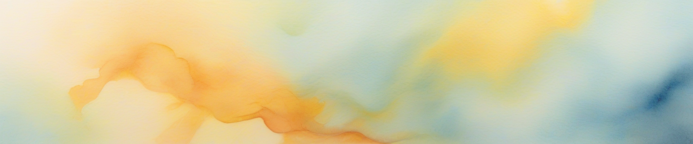
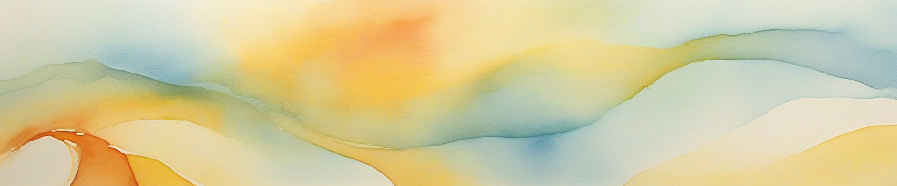
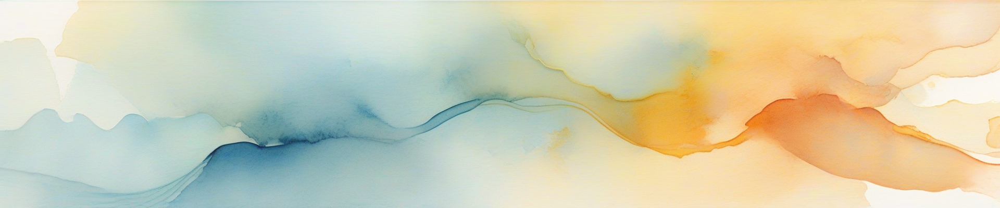

# Aipic


相关链接：**[博文](https://teahush.link/编程/Aipic图片生成项目)** | [一键部署](https://deploy.workers.cloudflare.com/?url=https://github.com/2010HCY/Aipic) | [GitHub页面](https://github.com/2010HCY/Aipic)

此项目使用Cloudflare免费提供的AI模型生成图片，使用CloudflareWorkers搭建。

有多个模型切换功能，支持以下模型：

```
dreamshaper-8-lcm (优化的照片级真实感模型)
stable-diffusion-xl-base-1.0 (高质量通用模型)
stable-diffusion-xl-lightning (快速生成模型)
flux-1-schnell (Black Forest Labs 12B参数模型)
```

可以设置生成的图像大小（flux-1-schnell不行，flux-1-schnell默认生成400×400的）

Cloudflare还提供以下模型

```
stable-diffusion-v1-5-img2img (图像到图像转换模型)
stable-diffusion-v1-5-inpainting (图像修复模型)
```

不过需要一张参考图片，我暂时没搞懂~~坐等PR~~

以下是页面预览，页面还是我特有的风格，十分好看：


## 关于AI模型

stable-diffusion-xl-base-1.0是我个人感觉质量最高的一个，但很容易出黑图，速度还可以，就是把分辨率拉满2048×2048的话会超时（免费版Workers单次Http请求最多30秒）

另外分辨率也不建议拉的过低，过低的话会出现乱七八糟无法描述的东西~~（祂们看着你）~~，建议拉到400以上。

消耗方面不高，我今天测试跑了差不多几十张图，也就消耗了1.56k神经元（每天免费10K）

dreamshaper-8-lcm模型说是优化的照片级真实感，但其实也没有多真实，感觉一般般有点类卡通。

目前支持的四种模型中文支持都很烂，所以提示词要使用英文。（未来此项目可能会接入Cloudflare提供的文字生成AI翻译提示词为英文，希望不要咕咕咕了）


如果喜欢我~~优秀制作高雅的品味~~的项目，就给我点个Star或去我的**[博文](https://teahush.link/编程/Aipic图片生成项目)**给我点个赞吧。最后再分享点stable-diffusion-xl-base-1.0生成的美图吧。








